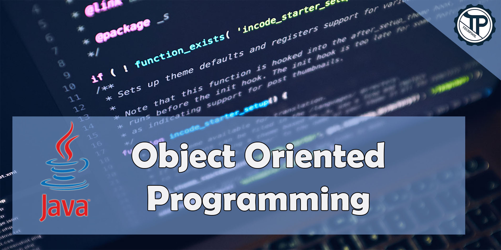

# JAVA-Core
## Simple examples done using Java OOP concepts

## Content

### [Introduction To Java](https://github.com/RahulSinghParmar/JAVA-Core/blob/04dac1abf303cebd25808b7ba3c278d39510bad7/Introduction%20To%20Java)
* [Example](https://github.com/RahulSinghParmar/JAVA-Core/blob/0cc681f4f948828098d09806d2f06f0604153dcb/Introduction%20To%20Java/src/Example.java)
* [HelloWorld](https://github.com/RahulSinghParmar/JAVA-Core/blob/0cc681f4f948828098d09806d2f06f0604153dcb/Introduction%20To%20Java/src/HelloWorld.java)

### [Introduction To Programming](https://github.com/RahulSinghParmar/JAVA-Core/blob/0cc681f4f948828098d09806d2f06f0604153dcb/Introduction%20To%20Programming)
* [Variable Creation](https://github.com/RahulSinghParmar/JAVA-Core/blob/0cc681f4f948828098d09806d2f06f0604153dcb/Introduction%20To%20Programming/src/Variable_creation.java)
* [Variable Naming rules](https://github.com/RahulSinghParmar/JAVA-Core/blob/0cc681f4f948828098d09806d2f06f0604153dcb/Introduction%20To%20Programming/src/Variable_Naming_Rules.java)
* [literals](https://github.com/RahulSinghParmar/JAVA-Core/blob/0cc681f4f948828098d09806d2f06f0604153dcb/Introduction%20To%20Programming/src/literals.java)
* [Data Types](https://github.com/RahulSinghParmar/JAVA-Core/blob/0cc681f4f948828098d09806d2f06f0604153dcb/Introduction%20To%20Programming/src/DataType.java)
* [Expression](https://github.com/RahulSinghParmar/JAVA-Core/blob/0cc681f4f948828098d09806d2f06f0604153dcb/Introduction%20To%20Programming/src/Expressions.java)
* [Input Methods](https://github.com/RahulSinghParmar/JAVA-Core/blob/0cc681f4f948828098d09806d2f06f0604153dcb/Introduction%20To%20Programming/src/Input.java)
* [Operators](https://github.com/RahulSinghParmar/JAVA-Core/blob/0cc681f4f948828098d09806d2f06f0604153dcb/Introduction%20To%20Programming/src/Operators)
* * [Arithmetic Operations](https://github.com/RahulSinghParmar/JAVA-Core/blob/0cc681f4f948828098d09806d2f06f0604153dcb/Introduction%20To%20Programming/src/Operators/Arithmetic_Operator.java)
* * [Assignment Operators](https://github.com/RahulSinghParmar/JAVA-Core/blob/0cc681f4f948828098d09806d2f06f0604153dcb/Introduction%20To%20Programming/src/Operators/Assignment_Operator.java)
* * [Bitwise Operations](https://github.com/RahulSinghParmar/JAVA-Core/blob/0cc681f4f948828098d09806d2f06f0604153dcb/Introduction%20To%20Programming/src/Operators/Bitwise_Operator.java)
* * [Unary Operations](https://github.com/RahulSinghParmar/JAVA-Core/blob/0cc681f4f948828098d09806d2f06f0604153dcb/Introduction%20To%20Programming/src/Operators/Unary_Operators)
* * * [Pre Increment operator](https://github.com/RahulSinghParmar/JAVA-Core/blob/0cc681f4f948828098d09806d2f06f0604153dcb/Introduction%20To%20Programming/src/Operators/Unary_Operators/Pre_Increment_Operator.java)
* * * [Pre Decrement operator](https://github.com/RahulSinghParmar/JAVA-Core/blob/0cc681f4f948828098d09806d2f06f0604153dcb/Introduction%20To%20Programming/src/Operators/Unary_Operators/Pre_Decrement_Operator.java)
* * * [Post Increment operator](https://github.com/RahulSinghParmar/JAVA-Core/blob/0cc681f4f948828098d09806d2f06f0604153dcb/Introduction%20To%20Programming/src/Operators/Unary_Operators/Post_Increment_Operator.java)
* * * [Post Decrement operator](https://github.com/RahulSinghParmar/JAVA-Core/blob/0cc681f4f948828098d09806d2f06f0604153dcb/Introduction%20To%20Programming/src/Operators/Unary_Operators/Post_Decrement_Operator.java)
* * [InstanceOf Operations](https://github.com/RahulSinghParmar/JAVA-Core/blob/0cc681f4f948828098d09806d2f06f0604153dcb/Introduction%20To%20Programming/src/Operators/InstanceOf_Operator.java)
* * [logical operations](https://github.com/RahulSinghParmar/JAVA-Core/blob/0cc681f4f948828098d09806d2f06f0604153dcb/Introduction%20To%20Programming/src/Operators/logical_Operator.java)
* * [Relational Operations](https://github.com/RahulSinghParmar/JAVA-Core/blob/0cc681f4f948828098d09806d2f06f0604153dcb/Introduction%20To%20Programming/src/Operators/Relational_Operator.java)
* * [Shifting Operations](https://github.com/RahulSinghParmar/JAVA-Core/blob/0cc681f4f948828098d09806d2f06f0604153dcb/Introduction%20To%20Programming/src/Operators/Shift_Operator.java)
* * [Ternary Operators](https://github.com/RahulSinghParmar/JAVA-Core/blob/0cc681f4f948828098d09806d2f06f0604153dcb/Introduction%20To%20Programming/src/Operators/Ternary_Operator.java)

### [Java Flow Control](https://github.com/RahulSinghParmar/JAVA-Core/blob/a7149e446566272ab4c1b0501688cea06d3cdcac/Java%20Flow%20Control)
* [if](https://github.com/RahulSinghParmar/JAVA-Core/blob/a7149e446566272ab4c1b0501688cea06d3cdcac/Java%20Flow%20Control/src/If.java)
* [if else](https://github.com/RahulSinghParmar/JAVA-Core/blob/a7149e446566272ab4c1b0501688cea06d3cdcac/Java%20Flow%20Control/src/If_else.java)
* [if else if ladder](https://github.com/RahulSinghParmar/JAVA-Core/blob/a7149e446566272ab4c1b0501688cea06d3cdcac/Java%20Flow%20Control/src/ladder_if_else_if.java)
* [if else nested](https://github.com/RahulSinghParmar/JAVA-Core/blob/a7149e446566272ab4c1b0501688cea06d3cdcac/Java%20Flow%20Control/src/Nested_If_else.java)
* [Switch case](https://github.com/RahulSinghParmar/JAVA-Core/blob/a7149e446566272ab4c1b0501688cea06d3cdcac/Java%20Flow%20Control/src/Switch_Case.java)
* [loop](https://github.com/RahulSinghParmar/JAVA-Core/blob/a7149e446566272ab4c1b0501688cea06d3cdcac/Java%20Flow%20Control/src/Loop)
* * [for loop](https://github.com/RahulSinghParmar/JAVA-Core/blob/a7149e446566272ab4c1b0501688cea06d3cdcac/Java%20Flow%20Control/src/Loop/For_Loop.java)
* * [for each loop](https://github.com/RahulSinghParmar/JAVA-Core/blob/a7149e446566272ab4c1b0501688cea06d3cdcac/Java%20Flow%20Control/src/Loop/For_each_loop.java)
* * [while loop](https://github.com/RahulSinghParmar/JAVA-Core/blob/a7149e446566272ab4c1b0501688cea06d3cdcac/Java%20Flow%20Control/src/Loop/While_loop.java)
* * [do while loop](https://github.com/RahulSinghParmar/JAVA-Core/blob/a7149e446566272ab4c1b0501688cea06d3cdcac/Java%20Flow%20Control/src/Loop/Do_While_loop.java)
* * [infinite loop](https://github.com/RahulSinghParmar/JAVA-Core/blob/a7149e446566272ab4c1b0501688cea06d3cdcac/Java%20Flow%20Control/src/Loop/Infinite_for_Loop.java)
* * [for Loop vs For each loop](https://github.com/RahulSinghParmar/JAVA-Core/blob/a7149e446566272ab4c1b0501688cea06d3cdcac/Java%20Flow%20Control/src/Loop/for_loop_VS_For_each_loop.java)
* [break statement](https://github.com/RahulSinghParmar/JAVA-Core/blob/a7149e446566272ab4c1b0501688cea06d3cdcac/Java%20Flow%20Control/src/Break.java)
* [break nested loop](https://github.com/RahulSinghParmar/JAVA-Core/blob/a7149e446566272ab4c1b0501688cea06d3cdcac/Java%20Flow%20Control/src/Break_nested_loop.java)
* [label break Loop](https://github.com/RahulSinghParmar/JAVA-Core/blob/a7149e446566272ab4c1b0501688cea06d3cdcac/Java%20Flow%20Control/src/Label_break_statement.java)
* [continue statement](https://github.com/RahulSinghParmar/JAVA-Core/blob/a7149e446566272ab4c1b0501688cea06d3cdcac/Java%20Flow%20Control/src/Continue.java)
* [continue nested Loop](https://github.com/RahulSinghParmar/JAVA-Core/blob/a7149e446566272ab4c1b0501688cea06d3cdcac/Java%20Flow%20Control/src/Continue_nested_loop.java)
* [label continue loop](https://github.com/RahulSinghParmar/JAVA-Core/blob/a7149e446566272ab4c1b0501688cea06d3cdcac/Java%20Flow%20Control/src/Label_continue_statement.java)

### Section 1
* Introduction to programming 
* Introduction to java 
* JDK installation 
* Keywords, Identifiers, variables 
* Operators 
* Method/Functions 
* Flow Control Statements 
* Arrays 
* Strings 
* Interactive programs in java using Scanner

### Section 2
#### Object Oriented Programming System
- Classes and Objects
- Object creation
- Reference variable
- Global and local variables
- Constructors
- Aggregation
- Composition
- Inheritance 
- Method Overloading
- Method Overriding
- Abstract classes
- Interfaces
- Typecasting
- JVM architecture
- Polymorphism
- Abstraction
- Java packages
- Access Specifies

### Section 3
####  Java Built-in packages and API
* Overview of java API
* Object class
* String, String Buffer and String Builder
* Exception Handling
* Threads and multithreading
* Wrapper Classes
* Data Structures
* JAVA Collection Frameworks
* File Handling
* Serialization
* Garbage Collector
* Encapsulation